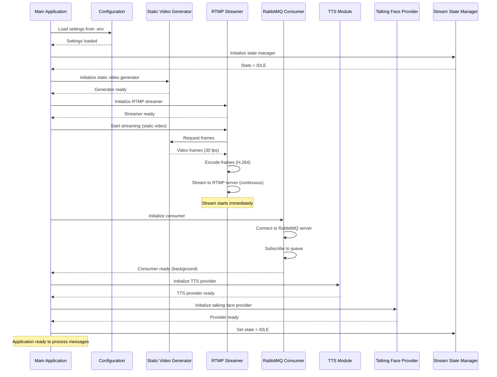
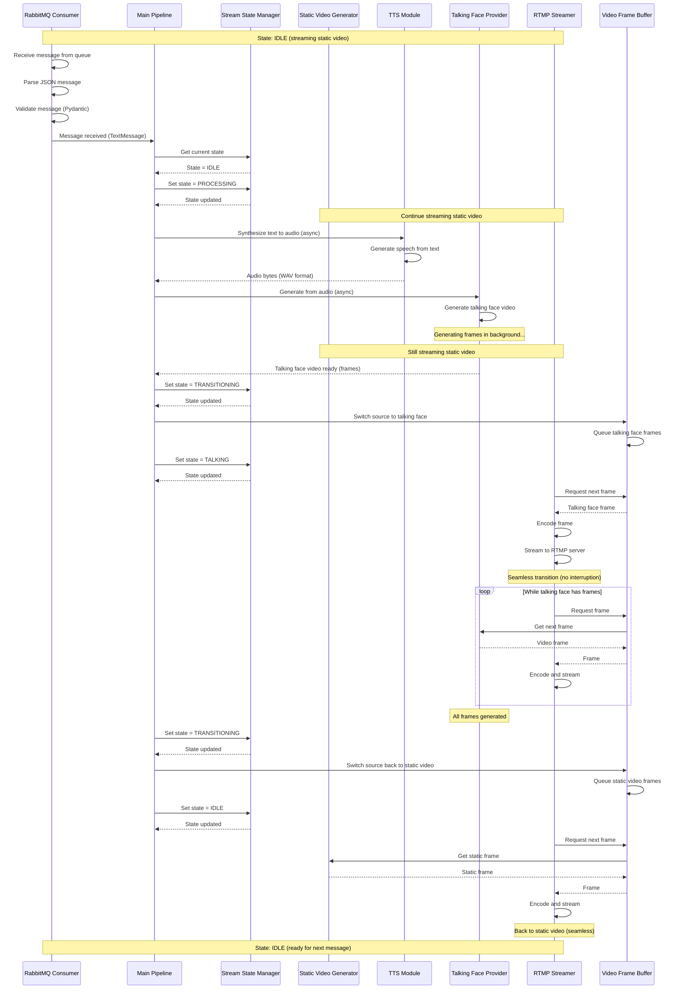
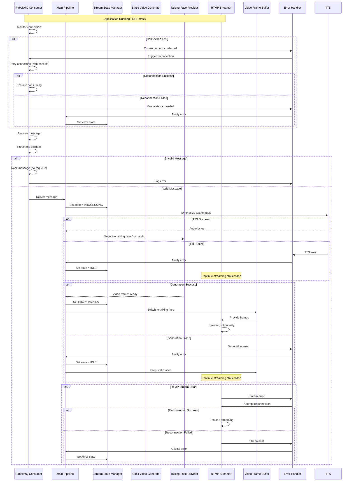
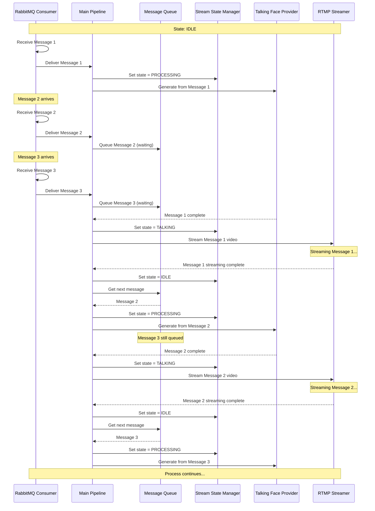
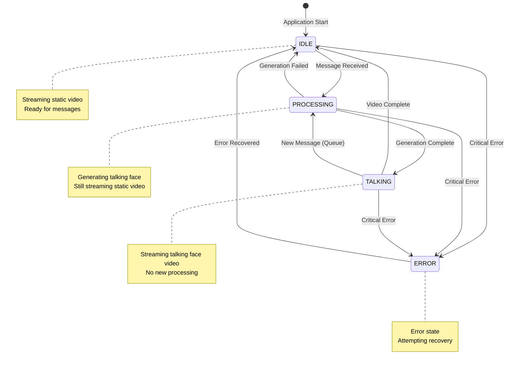
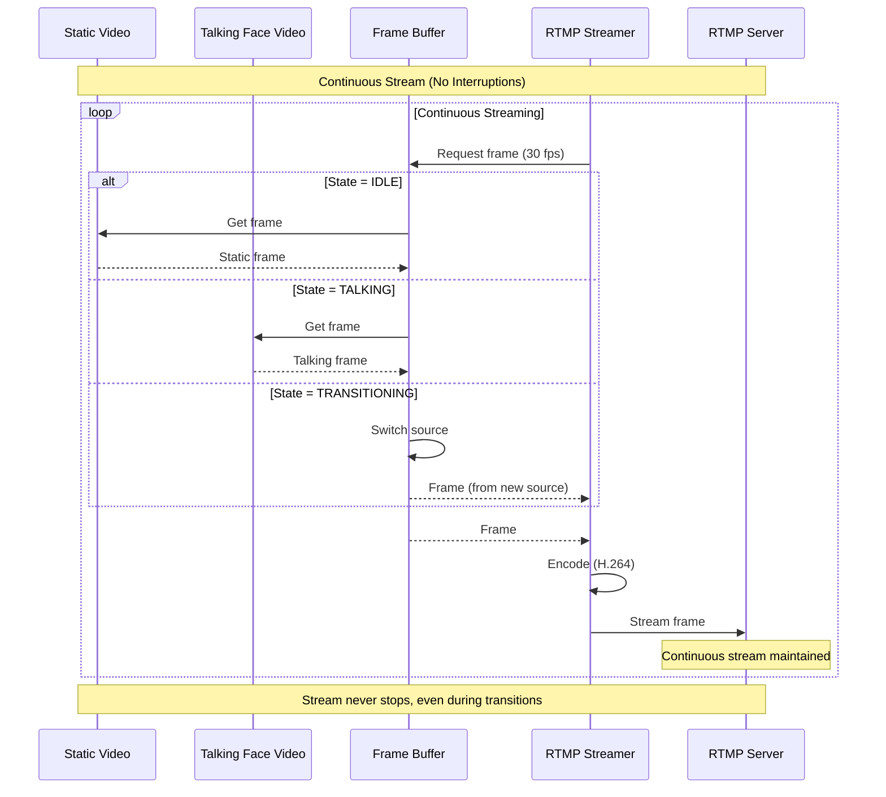

# Sequence Diagrams: PoC Processing Pipeline

This document contains sequence diagrams illustrating the flow of the talking face livestream PoC application.

## 1. Application Startup Sequence

This diagram shows the initialization sequence when the application starts.

## 2. Message Processing Flow (IDLE → TALKING → IDLE)

This diagram shows the complete flow when a message is received from RabbitMQ.

## 3. Complete Pipeline with Error Handling

This diagram shows the complete pipeline including error handling and reconnection logic.

## 4. Multiple Message Queue Handling

This diagram shows how the system handles multiple sequential messages.

## 5. Stream State Transitions

This diagram shows the state machine and valid transitions.

## 6. RTMP Streaming Continuity

This diagram emphasizes the continuous nature of the RTMP stream.

## Key Design Principles Illustrated

1. **Continuous Streaming**: RTMP stream never stops, even during state transitions
2. **Seamless Transitions**: Frame buffer ensures smooth switching between sources
3. **Background Processing**: Talking face generation happens while streaming static video
4. **Error Resilience**: Automatic reconnection and error recovery
5. **Message Queueing**: Multiple messages are queued and processed sequentially
6. **State Management**: Clear state machine with valid transitions

## Component Interactions Summary

- **Main Pipeline**: Orchestrates all components and manages flow
- **Stream State Manager**: Tracks current state (IDLE, PROCESSING, TALKING, ERROR)
- **RabbitMQ Consumer**: Receives and validates messages
- **Static Video Generator**: Provides idle state frames
- **TTS Module**: Converts text messages to audio (Text-to-Speech)
- **Talking Face Provider**: Generates talking face video from audio
- **Video Frame Buffer**: Manages frame queue and source switching
- **RTMP Streamer**: Encodes and streams frames continuously

## Text-to-Speech Integration

The TTS module is a critical component that bridges text messages and talking face generation:

1. **TextMessage Processing** (Only supported message type):
   - Pipeline receives TextMessage from RabbitMQ
   - Pipeline calls TTS module to synthesize text to audio
   - TTS returns audio bytes (WAV format, 44.1kHz, mono)
   - Pipeline passes audio to Talking Face Provider for lipsync inference
   - **Workflow**: Text → TTS → Audio → Talking Face Video

2. **TTS Providers**:
   - **Local TTS** (edge-tts): Free, high quality, no API key needed
   - **API TTS** (ElevenLabs, OpenAI, etc.): Premium quality, requires API key

